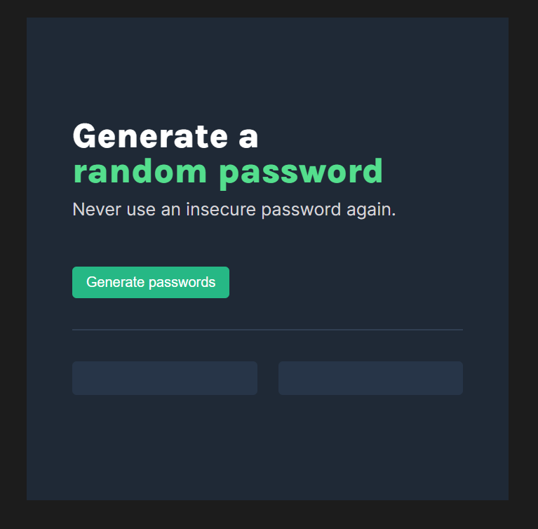
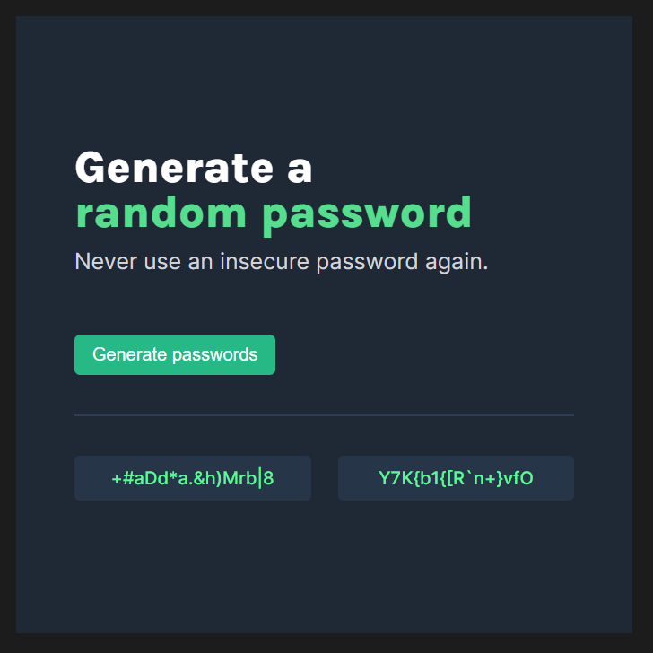

# Scrimba - The Frontend Developer Carrer Path - Module 3 - Password Generator project

Hello and welcome! Thank you for stopping by.🤠

This is a solution to the Scoreboard projects from _Module 3 - JavaScript challenges - part 2 chapter_ of the [The Frontend Career Path](https://scrimba.com/learn/frontend).

## Table of contents

- [Overview](#overview)
  - [The project](#the-challenge)
  - [Screenshot](#screenshot)
  - [Links](#links)
- [My process](#my-process)
  - [Built with](#built-with)
  - [What I learned](#what-i-learned)
  - [Continued development](#continued-development)
- [Author](#author)
- [Acknowledgments](#acknowledgments)
- [About Scrimba](#about-scrimba)

## Overview

### The project

Users should be able to:

- Generate two completely random passwords consisting of 15 characters including lower and upper case letters, numbers and other symbols

### Screenshot

State: Inactive


State: Active


### Links

- Solution URL: [Github Repository](https://github.com/PetrValenta92/password-generator)
- Live Site URL: [Github Pages](https://petrvalenta92.github.io/password-generator/)

## My process

### Built with

- Semantic HTML5 markup
- CSS custom properties
- CSS var() functions
- CSS hover pseudo-class
- Vanilla JavaScript
  - Onclick events
  - Functions
  - for Loop
  - getElementById method
  - textContent property
- JS Math Object
  - floor method
  - random method
- Flexbox

### What I learned

On the project, I mainly practiced how to work with the Math object and its .floor and .random methods. Also I practiced how to use a for loop in JavaScript.

Random passwords generation function with for loop and Math objects methods:

```js
function getPasswords() {
  passwordOneEl.textContent = "";
  passwordTwoEl.textContent = "";

  for (let i = 0; i <= 15; i++) {
    let char1 = Math.floor(Math.random() * characters.length);
    let char2 = Math.floor(Math.random() * characters.length);
    passwordOneEl.textContent += characters[char1];
    passwordTwoEl.textContent += characters[char2];
  }
}
```

### Continued development

In the future, I would like to add an extension where the user will be able to choose how long the password should be (number of characters) and what specific characters the password should contain. I would also like to add a button that will copy the selected password to clipboard.

## Author

- Website - _to be added..._
- GitHub - [@PetrValenta92](https://github.com/PetrValenta92)
- LinkedIn - [@valentapetr](https://www.linkedin.com/in/valentapetr/)
- Instagram - [@petr.codes](https://www.instagram.com/petr.codes/)

## Acknowledgments

I would love to thank whole [Scrimba](https://scrimba.com) team for such amazing project they have created. Also I want to thank the Scrimba community and specialy the [Junior Guru Community](https://junior.guru/) community! 🐣

## About Scrimba

At Scrimba our goal is to create the best possible coding school at the cost of a gym membership! 💜
If we succeed with this, it will give anyone who wants to become a software developer a realistic shot at succeeding, regardless of where they live and the size of their wallets 🎉
The Frontend Developer Career Path aims to teach you everything you need to become a Junior Developer, or you could take a deep-dive with one of our advanced courses 🚀

- [Our courses](https://scrimba.com/allcourses)
- [The Frontend Career Path](https://scrimba.com/learn/frontend)
- [Become a Scrimba Pro member](https://scrimba.com/pricing)

Happy Coding!
